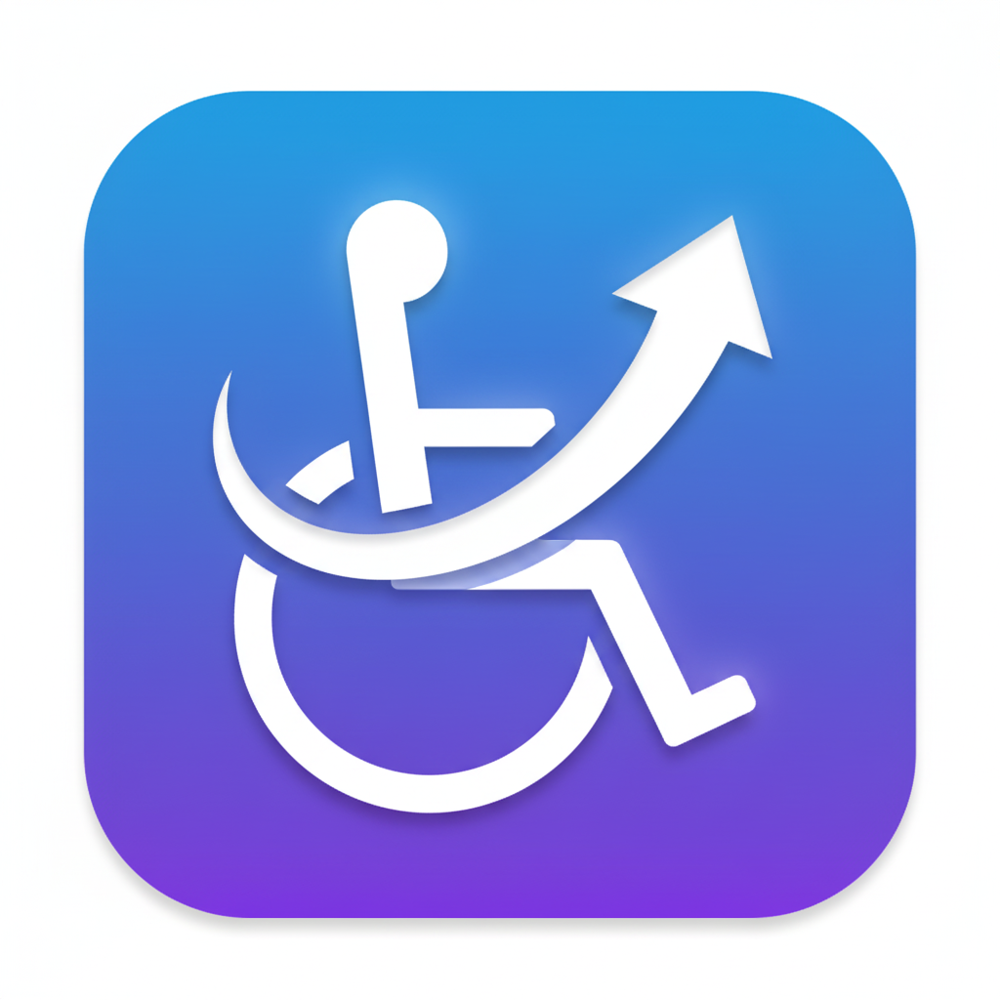

# NextBility: Accessibility Widget for Websites

<p align="center">
  
</p>

<div align="center">

[](https://github.com/chulit/NextBility-Accessibility-Widget/releases)
[](https://github.com/chulit/NextBility-Accessibility-Widget/issues)
[](https://github.com/chulit/NextBility-Accessibility-Widget/blob/master/LICENSE)

Lightweight (< 30 KB) accessibility controls for any website, ready in minutes and available in 40+ languages.

</div>

## Table of Contents
- [Overview](#overview)
- [Live Demo](#live-demo)
- [Installation](#installation)
- [Quick Start](#quick-start)
- [Configuration](#configuration)
- [Features](#features)
- [Local Development](#local-development)
- [Roadmap](#roadmap)
- [Contributing](#contributing)
- [License](#license)

## Overview
NextBility adds a customizable accessibility toolbar to your site so visitors can adjust contrast, typography, and interaction aids on demand. Drop it into any stack, adjust the language, and you are good to go.

## Live Demo
- Explore the widget in action: [nextbility.biz.id](https://nextbility.biz.id)
- Review the demo markup inside `demo/index.html`

## Installation

### Option A — npm
```bash
npm install next-bility
```

Then import the package in your bundler entry point. It bootstraps itself and attaches `window.NextBilityPlugin` when the document is ready.

```js
import "next-bility";
```

### Option B — CDN
Use the prebuilt bundle in `dist/next-bility.umd.js` or host it from your own CDN.

```html
<script src="dist/next-bility.umd.js" defer></script>
```

## Quick Start
```html
<script
  src="dist/next-bility.umd.js"
  data-nextbility-lang="en"
  data-nextbility-position="bottom-right"
  data-nextbility-offset="24,24"
  defer
></script>
```

## Configuration
Control the widget through `data-nextbility-*` attributes on the script tag or by calling helpers on `window.NextBilityPlugin` after it loads.

### Script Attributes
| Attribute | Description | Example |
|-----------|-------------|---------|
| `data-nextbility-lang` | Set the default UI language. | `data-nextbility-lang="en"` |
| `data-nextbility-position` | Choose where the launcher appears. | `data-nextbility-position="bottom-right"` |
| `data-nextbility-offset` | Adjust launcher offset (`x,y`). | `data-nextbility-offset="24,24"` |
| `data-nextbility-size` | Switch button size (`default`, `medium`, `small`). | `data-nextbility-size="medium"` |
| `data-nextbility-icon` | Provide custom HTML for the launcher icon. | `data-nextbility-icon="<span>♿️</span>"` |

### JavaScript Helpers
| Helper | Description | Example |
|--------|-------------|---------|
| `window.NextBilityPlugin.setIcon(html)` | Swap the floating launcher icon. | `NextBilityPlugin.setIcon("<span>🌈</span>")` |
| `window.NextBilityPlugin.changeLanguage(code)` | Switch the UI language at runtime. | `NextBilityPlugin.changeLanguage("fr")` |
| `window.NextBilityPlugin.registerLanguage(options)` | Register new translations on the fly. | `NextBilityPlugin.registerLanguage({ code: "id", label: "Bahasa Indonesia", dictionary: { "Accessibility Menu": "Menu Aksesibilitas" } })` |
| `window.NextBilityPlugin.resetAll()` | Restore widget defaults and clear saved settings. | `NextBilityPlugin.resetAll()` |

See `demo/index.html` for practical examples.

## Features
- **Multilingual UI** – 40+ ready-to-use locales with runtime translation hooks.
- **Content Adjustments** – Font size, letter spacing, line height, dyslexia-friendly typeface, highlight titles and links.
- **Color & Contrast Controls** – High contrast presets, monochrome mode, and a palette picker for granular customization.
- **Reading & Focus Tools** – Reading guide overlay, screen reader helper, voice navigation, and text-to-speech shortcuts.
- **Motion & Cursor Utilities** – Stop animations, desaturate images, enlarge the cursor for low-vision users.
- **Developer Hooks** – Expose helpers like `plugin.setIcon` for deeper UI personalization.

## Local Development
- Install dependencies: `npm install`
- Build the bundle: `npm run build`
- Serve the static demo: `npm run demo`
- Live reload during development: `npm run demo:serve` (esbuild watch + SSE reload)
- Open `http://127.0.0.1:4173/` to test screen reader, voice navigation, positioning, and custom locales

## Roadmap
- Accessibility profiles (save and load preset configurations)
- Widget size presets (Default, Medium, Small)

## Contributing
Improvements are welcome! Fork the repository and open a pull request with your changes. ❤️

## License
NextBility is released under the [MIT License](LICENSE).
