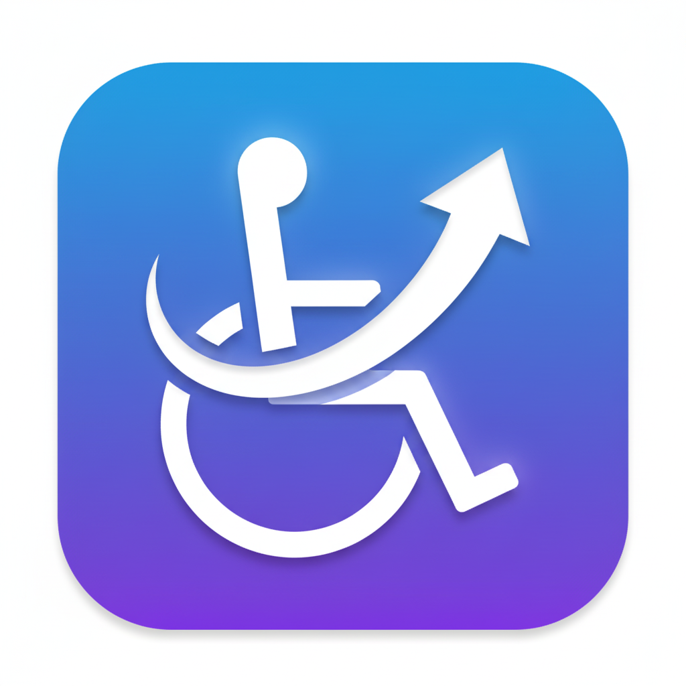

# Visua11y Agent: Universal Accessibility Website Widget

<p align="center">
  
</p>

<p align="center">
  <strong>⚡ Zero-dependency Universal Accessibility (a11y) Toolbar for WCAG 2.1 & ADA Website Compliance</strong>
</p>

<div align="center">

[](https://www.npmjs.com/package/visua11y-agent)
[](https://www.npmjs.com/package/visua11y-agent)
[](https://bundlephobia.com/package/visua11y-agent)
[](https://github.com/chulit/visua11y-agent/releases)
[](https://github.com/chulit/visua11y-agent/issues)
[](https://github.com/chulit/visua11y-agent/blob/master/LICENSE)

</div>

## Table of Contents

- [Overview](#overview)
- [Live Demo](#live-demo)
- [Installation](#installation)
- [Quick Start](#quick-start)
- [Configuration](#configuration)
- [Features](#features)
- [Local Development](#local-development)
- [Roadmap](#roadmap)
- [Contributing](#contributing)
- [License](#license)

## Overview

Visua11y Agent adds a customizable accessibility toolbar to your site so visitors can adjust contrast, typography, and interaction aids on demand. Drop it into any stack, adjust the language, and you are good to go.

## Project Structure

The project is organized into several key directories under `src/`:

-   **`components/`**: Contains UI components such as the accessibility menu and widget.
-   **`config/`**: Holds configuration files for the plugin and user settings.
-   **`core/`**: The core logic and entry point for the Visua11y Agent.
-   **`enum/`**: Defines enumerations used throughout the project.
-   **`i18n/`**: Internationalization (i18n) related files for language handling.
-   **`icons/`**: Stores SVG icons used in the widget.
-   **`locales/`**: JSON files containing translations for various languages.
-   **`storage/`**: Handles local storage and persistence of user settings.
-   **`tools/`**: Implements the various accessibility tools (e.g., font adjustments, contrast modes).
-   **`types/`**: TypeScript type definitions.
-   **`utils/`**: Utility functions used across the project.

## Live Demo

- Explore the widget in action: [chulit.github.io/visua11y-agent](https://chulit.github.io/visua11y-agent)
- Review the demo markup inside `demo/index.html`

## Installation

### Option A — npm

```bash
npm install visua11y-agent
```

Then import the package in your bundler entry point. It bootstraps itself and attaches `window.Visua11yAgentPlugin` when the document is ready.

```js
import 'visua11y-agent';
```

### Option B — CDN

Every release is published to npm, so any npm-backed CDN can serve the compiled bundle immediately.

- **jsDelivr (UMD)** — `https://cdn.jsdelivr.net/npm/visua11y-agent@1.2.0/dist/visua11y-agent.umd.js`
- **unpkg (UMD)** — `https://unpkg.com/visua11y-agent@1.2.0/dist/visua11y-agent.umd.js`
- **esm.sh (native ESM)** — `https://esm.sh/visua11y-agent`
- **Skypack (native ESM)** — `https://cdn.skypack.dev/visua11y-agent`
- **esm.run (native ESM)** — `https://esm.run/visua11y-agent`
- **JSPM Generator (dual)** — `https://ga.jspm.io/npm:visua11y-agent/dist/visua11y-agent.esm.js`

Stick to pinned versions for stability (`@1.2.0`) and switch to `@latest` if you want automatic upgrades.

```html
<script
  src="https://cdn.jsdelivr.net/npm/visua11y-agent@1.2.0/dist/visua11y-agent.umd.js"
  defer
></script>
```

## Quick Start

```html
<script
  src="https://cdn.jsdelivr.net/npm/visua11y-agent@1.2.0/dist/visua11y-agent.umd.js"
  data-visua11y-agent-lang="en"
  data-visua11y-agent-position="bottom-right"
  data-visua11y-agent-offset="24,24"
  defer
></script>
```

## Universal Usage

Visua11y Agent supports **multiple usage patterns** for maximum flexibility:

### Modern ES Module (Recommended)

```js
import { createVisua11yAgent } from 'visua11y-agent';

const plugin = createVisua11yAgent({
  lang: 'en',
  position: 'bottom-right',
  size: 'medium',        // overall widget (button + panel)
  buttonSize: 52,        // override trigger button size only (px)
  iconSize: 28           // override icon size only (px)
});

// Use the API
plugin.setWidgetSize('small');
plugin.setButtonSize(48);
plugin.setIconSize(26);
plugin.openMenu();
```

### Vue 3 / React

```js
// Vue Composable or React Hook
import { createVisua11yAgent } from 'visua11y-agent';

const plugin = createVisua11yAgent({ lang: 'id' });
plugin.setWidgetSize('small');
```

See [Universal Usage Guide](./docs/guide/universal-usage.md) for complete examples including Vue composables, React hooks, Pinia stores, and React Context patterns.

## Configuration

Control the widget through `data-visua11y-agent-*` attributes on the script tag or by calling helpers on `window.Visua11yAgentPlugin` after it loads.

### Script Attributes

| Attribute                      | Description                                        | Example                                       |
| ------------------------------ | -------------------------------------------------- | --------------------------------------------- |
| `data-visua11y-agent-lang`     | Set the default UI language.                       | `data-visua11y-agent-lang="en"`               |
| `data-visua11y-agent-position` | Choose where the launcher appears.                 | `data-visua11y-agent-position="bottom-right"` |
| `data-visua11y-agent-offset`   | Adjust launcher offset (`x,y`).                    | `data-visua11y-agent-offset="24,24"`          |
| `data-visua11y-agent-size`     | Switch overall widget size (`default`, `medium`, `small`). | `data-visua11y-agent-size="medium"`   |
| `data-visua11y-agent-icon`     | Provide custom HTML for the launcher icon.         | `data-visua11y-agent-icon="<span>♿️</span>"`  |

### Preset Profiles

Inside the widget you will now find four saved profiles backed by `localStorage`. When a visitor chooses one, we persist the associated combination of tools (font size, contrast, cursor, etc.) so it auto-loads on their next visit.

| Profile              | What it toggles                                                                 |
| -------------------- | ------------------------------------------------------------------------------- |
| `Motor Impaired`     | Big cursor, voice navigation, animations off, +10% font.                        |
| `Blind`              | High contrast, screen reader & voice helpers, +15% font.                        |
| `Color Blind`        | High-contrast palette, desaturated media, highlighted links.                    |
| `Dyslexia`           | Dyslexia-friendly font, extra spacing, bolder weights.                          |
| `Low vision`         | 130% font, dark contrast, readable font, big cursor.                            |
| `Cognitive & Learning` | Highlights titles/links, reading guide, voice navigation.                    |
| `Seizure & Epileptic` | Stops animations, low saturation, grayscale imagery.                          |
| `ADHD`               | Reading guide, highlighted content, calming contrast.                           |

Selecting any profile also adjusts the widget button/panel size to match the preset, while manual tweaks instantly break away from the preset so users stay in control.

### JavaScript Helpers

| Helper                                                 | Description                                       | Example                                                                                                                                       |
| ------------------------------------------------------ | ------------------------------------------------- | --------------------------------------------------------------------------------------------------------------------------------------------- |
| `window.Visua11yAgentPlugin.setIcon(html)`             | Swap the floating launcher icon.                  | `Visua11yAgentPlugin.setIcon("<span>🌈</span>")`                                                                                              |
| `window.Visua11yAgentPlugin.changeLanguage(code)`      | Switch the UI language at runtime.                | `Visua11yAgentPlugin.changeLanguage("fr")`                                                                                                    |
| `window.Visua11yAgentPlugin.registerLanguage(options)` | Register new translations on the fly.             | `Visua11yAgentPlugin.registerLanguage({ code: "id", label: "Bahasa Indonesia", dictionary: { "Accessibility Menu": "Menu Aksesibilitas" } })` |
| `window.Visua11yAgentPlugin.setWidgetSize(size)`     | Change the widget button size.                    | `Visua11yAgentPlugin.setWidgetSize("small")`                                                                                                  |
| `window.Visua11yAgentPlugin.setPosition(position)`     | Move the widget to a new position.                | `Visua11yAgentPlugin.setPosition("top-left")`                                                                                                 |
| `window.Visua11yAgentPlugin.setOffset(offset)`         | Adjust the widget offset.                         | `Visua11yAgentPlugin.setOffset("50,50")`                                                                                                      |
| `window.Visua11yAgentPlugin.openMenu()`                | Open the accessibility menu.                      | `Visua11yAgentPlugin.openMenu()`                                                                                                              |
| `window.Visua11yAgentPlugin.closeMenu()`               | Close the accessibility menu.                     | `Visua11yAgentPlugin.closeMenu()`                                                                                                             |
| `window.Visua11yAgentPlugin.toggleTool(key, enable)`   | Toggle a specific tool on or off.                 | `Visua11yAgentPlugin.toggleTool("high-contrast", true)`                                                                                       |
| `window.Visua11yAgentPlugin.setProfile(profileId)`     | Set the active accessibility profile.             | `Visua11yAgentPlugin.setProfile("blind")`                                                                                                     |
| `window.Visua11yAgentPlugin.getSettings()`             | Get the current user settings object.             | `console.log(Visua11yAgentPlugin.getSettings())`                                                                                              |
| `window.Visua11yAgentPlugin.hideFooter(hide)`          | Hide or show the menu footer.                     | `Visua11yAgentPlugin.hideFooter(true)`                                                                                                        |
| `window.Visua11yAgentPlugin.setFooterSize(size)`       | Set the menu footer size.                         | `Visua11yAgentPlugin.setFooterSize("small")`                                                                                                  |
| `window.Visua11yAgentPlugin.resetAll()`                | Restore widget defaults and clear saved settings. | `Visua11yAgentPlugin.resetAll()`                                                                                                              |

See `demo/index.html` for practical examples.

## Features

- **Multilingual UI** – 40+ locales bundled out of the box, live language switching, searchable dropdown, and runtime registration for custom dictionaries.
- **Accessibility Profiles** – Curated presets (Motor, Blind, Color Blind, Dyslexia, Low Vision, Cognitive, Seizure, ADHD) that toggle tools, widget size, position, and offsets while keeping previous states in case users exit the preset.
- **Content Adjustments** – Font scaling, weight, letter spacing, line height, dyslexia-friendly font, plus highlight toggles for links and headings.
- **Color & Contrast Controls** – Dark/Light/High contrast, invert colors, saturation controls, monochrome, image desaturation, and a custom palette generator covering headings, body, and backgrounds.
- **Focus, Reading & Assistive Tools** – Reading guide overlay, screen reader helper, voice navigation, text emphasis counters, and selectable accessibility tool grid.
- **Motion & Cursor Utilities** – Stop animations, disable animated GIFs, enlarge cursor, and calm color palettes for sensory comfort.
- **Widget Customization** – Position picker (8 anchors + offsets), button size presets or custom pixel values, adjustable panel width, and icon overrides.
- **Persistence & Recovery** – Every change syncs to `localStorage` with cookie fallback, profiles remember the prior state, and a single reset clears everything.
- **Developer Hooks** – `setIcon`, `changeLanguage`, `registerLanguage`, `resetAll`, and other helpers exposed on `window.Visua11yAgentPlugin` for scripts and CMS integrations.

## Menu Structure

The widget stacks multiple cards so visitors can quickly find the control they need:

- **Accessibility Profiles** – Curated scenario presets with collapsible grid UI, profile badges, and live previews so users can jump straight to the best combination.
- **Content Adjustments** – Font-size slider with keyboard-friendly steppers plus quick buttons for weight, spacing, line height, dyslexia font, title/link highlights, and more.
- **Color Adjustments** – Contrast palette grid, invert/mono/saturation options, and the custom palette card for backgrounds, headings, and content hues complete with hue sliders and hex inputs.
- **Tools** – Reading guide, screen reader helper, voice navigation, cursor, animation, and other assistive toggles grouped into a searchable grid.
- **Widget Settings** – Button/panel size selector, position picker, offset inputs, language switcher, and quick actions (reset, open language drawer).

## Local Development

- Install dependencies: `npm install`
- Build the bundle: `npm run build`
- Serve the static demo: `npm run demo`
- Live reload during development: `npm run demo:serve` (esbuild watch + SSE reload)
- Open `http://127.0.0.1:4173/` to test screen reader, voice navigation, positioning, and custom locales

## Roadmap

Semua item dalam roadmap awal (termasuk Accessibility Profiles) telah dirilis. Ajukan fitur atau peningkatan baru melalui issue GitHub agar kami bisa menyusun roadmap selanjutnya bersama komunitas.

## Contributing

We welcome contributions from the community! Whether you're fixing bugs, adding features, improving documentation, or translating to new languages, your help is appreciated. ❤️

### How to Contribute

1. **Fork the repository** and create your feature branch
   ```bash
   git checkout -b feature/amazing-feature
   ```

2. **Make your changes** following our code style
   - Write clear, descriptive commit messages
   - Add tests for new features
   - Update documentation as needed

3. **Test your changes**
   ```bash
   npm test
   npm run build
   npm run demo
   ```

4. **Submit a pull request** with a clear description of your changes

### Ways to Contribute

- 🐛 **Report bugs** - Open an issue with reproduction steps
- ✨ **Suggest features** - Share your ideas for improvements
- 🌍 **Add translations** - Help make Visua11y accessible in more languages
- 📝 **Improve docs** - Fix typos, add examples, clarify explanations
- 🧪 **Write tests** - Increase code coverage and reliability
- 💻 **Submit code** - Fix bugs or implement new features

### Development Setup

```bash
git clone https://github.com/chulit/visua11y-agent.git
cd visua11y-agent
npm install
npm run demo:serve  # Start development server with hot reload
```

For questions or discussions, feel free to open an issue or reach out to the maintainers.

## License

Visua11y Agent is released under the [MIT License](LICENSE).
